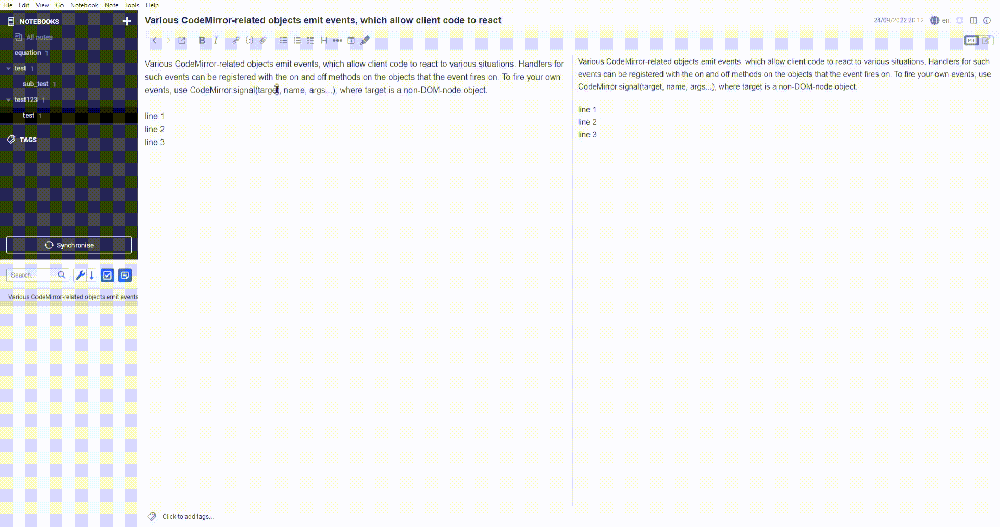

# Overview

Simple highlighter to highlight the selected text by wrapping == around the selected text. Able to dehighlight the word using same button / command.



# Remark

- Highlight style follows the markdown stylesheet. To customise the style, go to Tools → Options → Appearance → Show Advanced Settings → Custom stylesheet for rendered Markdown
```
    mark {
        /* Sample style. Sets the background and font colour of user highlighted text (==mark==) */
        background-color: red;
        color: white;
    }
```
- Please select all highlighted text to dehighlight properly. Selecting the == is optional. Refer to the GIF above
